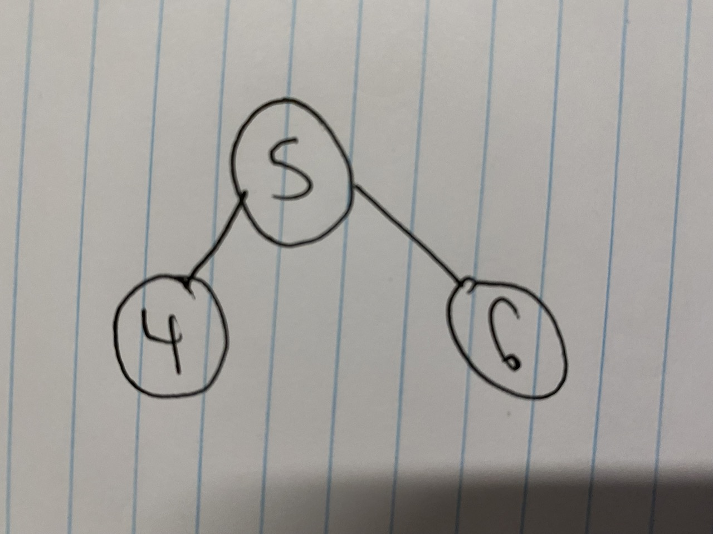
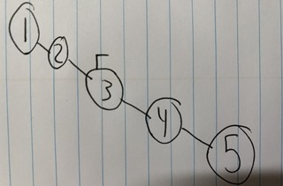
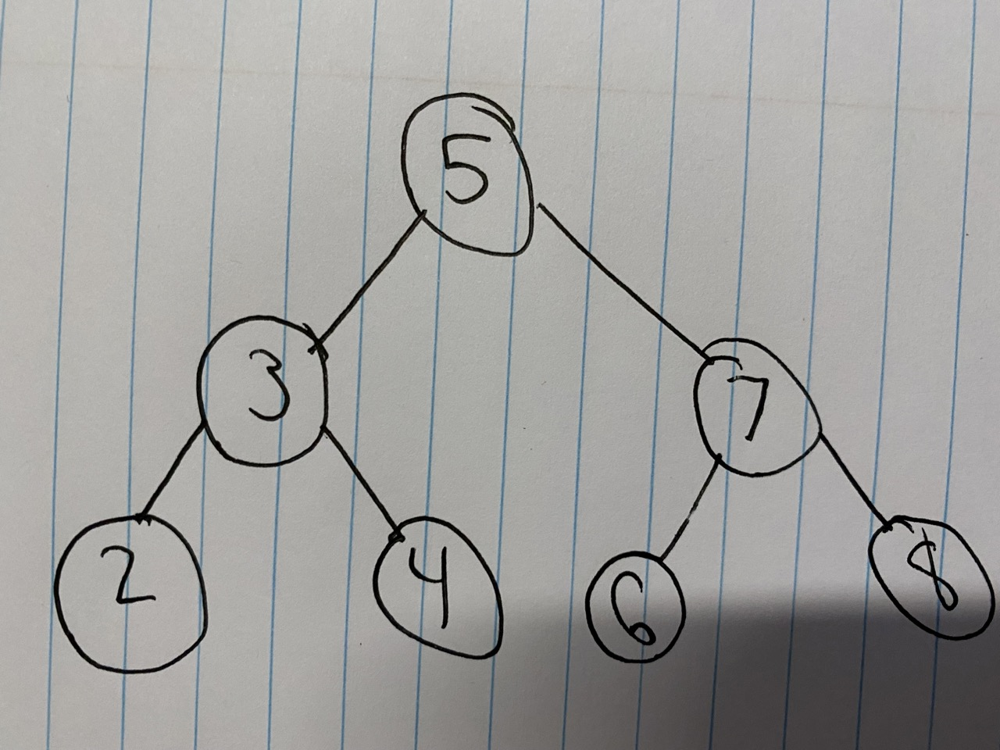

# Trees
---
[Previous Topic](2-topic_linked_list.md)

[Main menu](0-welcome.md)
## Intro
Trees in a programming sense are a method of sorting data to make storage and recovery more efficient for data and time - a Binary Search Tree (BST/bst). By using an O(log n) time, we're able to store, access, and interact with even massive datasets in an efficient manner. 
To arrange data into a bst, you take the dataset, and find the center of it, then place things on the left or right of that value, with items on the left being of a smaller value and the ones on the right being of a greater value. For the sake of clarity, an image will be drawn to demonstrate.
If we add 5 as the center, and 4 and 6 afterward, we'll see a tree arranged like this:



4 is less than 5, so it is placed on the left, while 6 is greater than 5, so it is placed on the right. With this in mind, the order you add these values to the tree are VERY important. Say you were add the values 1 to 5 to a bst, without setting the center of the data as the root, you'd get something like this:

This is inefficent, and no better than a linked list, so you've only wasted your time.
The process you want to follow to add items to a tree is such: the 1/2, the 1/4, and the 3/4. These items refer to the index items they are within the list. From there, you keep adding the 1/4 and 3/4 values. As you continue, you should get something that looks like this:


## Recursion
The method that we use to add items to a bst is called recursion, it is the process of having a function call itself. 
For example:
```python
def print_self(x):
    print('hi')
    if x > 0:
        x -= 1
        print_self(x)
print_self(2)
```
This function will call itself until x (the counter) is 0, where it will stop. As it calls itself, it will print 'hi' three times.
Recursion is a powerful method of coding, and can be quite efficient, but the biggest thing to be careful of when using it is setting a clear END CONDITION. If you fail to do so, either it will run forever, or it will hit a recursion error. In both cases, the program has failed. 
A few tips:
* A stack is created with each layer of recursion, as these stacks are each unique, the item you return will only return to the stack immediately below it. So if you wish to return an item from several stacks deep to a global position, you need a way to pass it up through each stack.
* You can use arguments such as lists, counters, and dictionaries to act as a memory to remember information from stack to stack.
* Creating conditions for various circumstances to occur is very important to ensuring everything works properly. 
## Example BST:
```python

class BST:
    """
    Implement the Binary Search Tree (BST) data structure.  The Node 
    class below is an inner class.  An inner class means that its real 
    name is related to the outer class.  To create a Node object, we will 
    need to specify BST.Node
    """

    class Node:
        """
        Each node of the BST will have data and links to the 
        left and right sub-tree. 
        """

        def __init__(self, data):
            """ 
            Initialize the node to the data provided.  Initially
            the links are unknown so they are set to None.
            """
       
            self.data = data
            self.left = None
            self.right = None

    def __init__(self):
        """
        Initialize an empty BST.
        """
        self.root = None

    def insert(self, data):
        """
        Insert 'data' into the BST.  If the BST
        is empty, then set the root equal to the new 
        node.  Otherwise, use _insert to recursively
        find the location to insert.
        """
        if self.root is None:
            self.root = BST.Node(data)
        else:
            self._insert(data, self.root)  # Start at the root

    def _insert(self, data, node):
        """
        This function will look for a place to insert a node
        with 'data' inside of it.  The current sub-tree is
        represented by 'node'.  This function is intended to be
        called the first time by the insert function.
        """
        if data < node.data:
            # The data belongs on the left side.
            if node.left is None:
                # We found an empty spot
                node.left = BST.Node(data)
            else:
                # Need to keep looking.  Call _insert
                # recursively on the left sub-tree.
                self._insert(data, node.left)
        elif data >= node.data:
            # The data belongs on the right side.
            if data == node.data:
                return
            elif node.right is None:
                # We found an empty spot
                node.right = BST.Node(data)
            else:
                # Need to keep looking.  Call _insert
                # recursively on the right sub-tree.
                self._insert(data, node.right)

    def __contains__(self, data):
        """ 
        Checks if data is in the BST.  This function
        supports the ability to use the 'in' keyword:

        if 5 in my_bst:
            ("5 is in the bst")

        """
        return self._contains(data, self.root)  # Start at the root

    def _contains(self, data, node):
        """
        This funciton will search for a node that contains
        'data'.  The current sub-tree being search is 
        represented by 'node'.  This function is intended
        to be called the first time by the __contains__ function.
        """
        try:
            if data == node.data:
                return True
            elif data < node.data:
                    return self._contains(data, node.left)
            elif data > node.data:
                    return self._contains(data, node.right)
        except AttributeError:
            return False

    def __iter__(self):
        """
        Perform a forward traversal (in order traversal) starting from 
	    the root of the BST.  This is called a generator function.
        This function is called when a loop	is performed:

        for value in my_bst:
            print(value)

        """
        yield from self._traverse_forward(self.root)  # Start at the root
        
    def _traverse_forward(self, node):
        """
        Does a forward traversal (in-order traversal) through the 
        BST.  If the node that we are given (which is the current
        sub-tree) exists, then we will keep traversing on the left
        side (thus getting the smaller numbers first), then we will 
        provide the data in the current node, and finally we will 
        traverse on the right side (thus getting the larger numbers last).

        The use of the 'yield' will allow this function to support loops
        like:

        for value in my_bst:
            print(value)

        The keyword 'yield' will return the value for the 'for' loop to
	    use.  When the 'for' loop wants to get the next value, the code in
	    this function will start back up where the last 'yield' returned a 
	    value.  The keyword 'yield from' is used when our generator function
        needs to call another function for which a `yield` will be called.  
        In other words, the `yield` is delegated by the generator function
        to another function.

        This function is intended to be called the first time by 
        the __iter__ function.
        """
        if node is not None:
            yield from self._traverse_forward(node.left)
            yield node.data
            yield from self._traverse_forward(node.right)
        
    def __reversed__(self):
        """
        Perform a formward traversal (in order traversal) starting from 
        the root of the BST.  This function is called when a the 
        reversed function is called and is frequently used with a for
        loop.

        for value in reversed(my_bst):
            print(value)

        """        
        yield from self._traverse_backward(self.root)  # Start at the root

    def _traverse_backward(self, node):
        """
        Does a backwards traversal (reverse in-order traversal) through the 
        BST.  If the node that we are given (which is the current
        sub-tree) exists, then we will keep traversing on the right
        side (thus getting the larger numbers first), then we will 
        provide the data in the current node, and finally we will 
        traverse on the left side (thus getting the smaller numbers last).

        This function is intended to be called the first time by 
        the __reversed__ function.        
        """
        if node is not None:
            yield from self._traverse_backward(node.right)
            yield node.data
            yield from self._traverse_backward(node.left)

    def get_height(self):
        """
        Determine the height of the BST.  Note that an empty tree
        will have a height of 0 and a tree with one item (root) will
        have a height of 1.
        
        If the tree is empty, then return 0.  Otherwise, call 
        _get_height on the root which will recursively determine the 
        height of the tree.
        """
        if self.root is None:
            return 0
        else:
            return self._get_height(self.root)  # Start at the root

    def _get_height(self, node, pth =''):
        """
        Determine the height of the BST.  The height of a sub-tree 
        (represented by 'node') is 1 plus the height of either the 
        left sub-tree or the right sub-tree (whichever one is bigger).

        This function intended to be called the first time by 
        get_height.
        """
        if node is self.root:
            if node.left is None and node.right is None:
                return 1
            left = self._get_height(node.left, 'left')
            right = self._get_height(node.right, 'right')
            return max(left, right)
        elif node is not self.root:
            if node is not None:
                if pth == 'left':
                    return (self._get_height(node.left, pth) + 1)
                elif pth == 'right':
                    return (self._get_height(node.right, pth) + 1)
            elif node is None:
                return 1
```
## Problems
Use the code from the example BST for this section.
```python
bst = BST()

#Problem 1:
#Add items to the bst from 1 to 5. Set 3 as the root, and add them in the proper order after that. Print all the items in the bst, then get the height of it.
#Hint: check the __iter__(self) comment for help with this problem.


#Problem 2:
#Use the __contains__(self) method to see if 4 is in the tree.


#Problem 3:
#Create a new bst. Add as many values of type(int) you chooose, but get the tree to be 4 tall, and use at least 6 values.
```

[Solutions](solution3_trees.md)